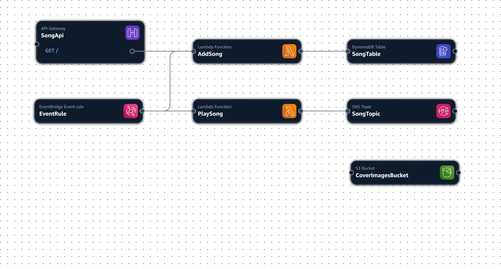

# Exam preparation

Your friend Boyko has an online radio station and wants to make his life easier by automating the management of his playlist. He wants to be able to add songs to the playlist via a public URL, to which requests will be sent in JSON format. Each song must have a title, artist, status, and a time when it should be played (for convenience, playAt must always be in the future).

Example request:

```
{

"title": "Never Gonna Give You Up",

"artist": "Rick Astley",

"status": "scheduled",

"playAt": "2025-07-15T16:00:00Z",

"coverImage": "https://.../...jpg"

}
```

All songs must be stored somewhere to quickly, efficiently, and cheaply retrieve song data in case of a check by the National Radio and Television Council (SЕМ). Boyko also wants to add a link to the cover image for each song. JPEG files should be stored in the cloud. It should be possible to quickly search by the artist's name. When the time comes for the song to be played, its status should change to "played". Upon this change, DJ Boyko wants to receive an email with information about the song to play, including the title and artist.


The entire project should be uploaded to a public GitHub repository with a CI/CD pipeline that checks the code and deploys it. There should be a test of the stack, as well as clear documentation of the architecture, an explanation of the service choices, and a description of potential alternative approaches. There should also be an architectural diagram that clearly explains the components.


Add instructions for Boyko on how to test the functionalities before publishing them. Also, calculate the expected monthly cost for:


· 3,000,000 song addition requests per month, with each song having a cover image of 2MB


in the eu-central-1 region.

# Resources

- API Gateway
    - Resource
    - Method
- Lambda-2
- SNS
    - Topic
    - Subscription
- S3 bucket
- DynamoDB Table + Index
- EventBridge Rule


# Architecture Diagram



# Packages

- npm i esbuild
- npm i @types/aws-lambda
- npm i uuid
- npm i aws-sdk
- npm i @aws-sdk/client-sns
- npm i @aws-sdk/client-dynamodb
- npm i @aws-sdk/client-scheduler

# Const estimation
- Region: us-central-1
- API Gateway:
    - 3 * $1.20 = ~$3.60
- Lambda
    - 128 (...) ~750ms = 0.75s
- Amazon S3
    - 3M * 2MB = 6TB
- ...


## Useful commands

* `npm run build`   compile typescript to js
* `npm run watch`   watch for changes and compile
* `npm run test`    perform the jest unit tests
* `npx cdk deploy`  deploy this stack to your default AWS account/region
* `npx cdk diff`    compare deployed stack with current state
* `npx cdk synth`   emits the synthesized CloudFormation template