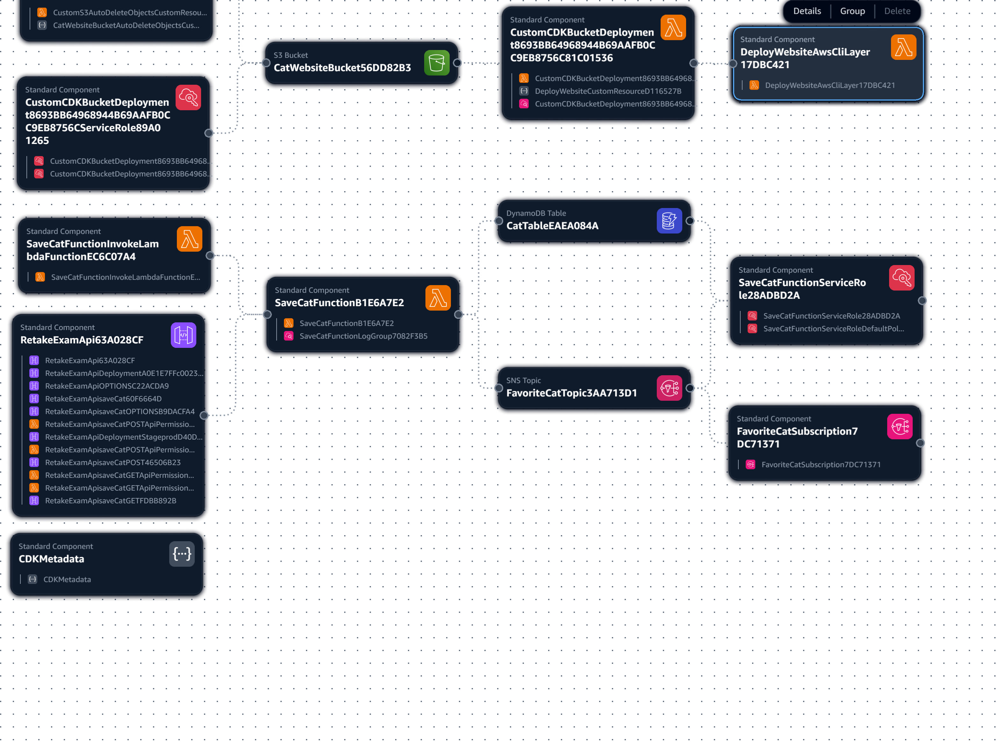

# Retake Exam

Your friend Lydia wants a simple website that shows a random cat picture from the internet and allows it to be saved as a favorite. Every time the user clicks the "Save cat" button, this cat is saved in the system, and Lydia gets a message that she has a new favorite cat. Up to this point, she has done quite a bit of work, but she needs your help to finish her idea. 

She has prepared a basic local HTML site that she started but hasn't completed. She needs a few more lines of code and needs to upload it somewhere on the internet. So far, she has managed to make the website load a cat through a public API (Cat as a Service https://cataas.com) when the user loads the site. The user sees the image, and if they like it, they can click the button (in her HTML) to save it. When the button is clicked, the image link and the cat's identifier must be sent somewhere in the cloud. 

In the documentation of Cat as a Service (https://cataas.com/doc.html) under the /cat section, there is an option to try their API. 

Once the save is done, Lydia wants to receive a message that she has a new favorite cat and get the link to the image. 

She has heard from Nasco that Single Table Design can be used. She wants to always have exactly one favorite picture. That is, when a new one is selected, the previous favorite should no longer be considered as such. 

The solution must be implemented with AWS resources and described using CDK in TypeScript. The emails must be actually sent, so you can use your own email for testing. She has also heard about CORS settings for communication between the site and the backend. A working configuration is provided. 

Lydia wants the project in a public GitHub Repository, which should also contain a meaningful and working CI/CD Pipeline that ensures the quality of the code after it is uploaded. 

This repository should include a snapshot test of the stack. 

She will appreciate as many meaningful logs as possible, where necessary, to facilitate debugging in the future. She plans to expand the project and will be very happy if reusable constructs are used that can be easily reused in the future.

## GitHub Repo:
https://github.com/BoykoPetevBoev/SoftUni-AWS-Essentials-June-2025

### 🚀 Getting Started

1. **Clone the repository:**
   ```bash
   git clone https://github.com/yourusername/SoftUni-AWS-Essentials-June-2025.git
   ```

2. **Navigate to the retake-exam folder:**
   ```bash
   cd SoftUni-AWS-Essentials-June-2025/retake-exam
   ```

3. **Install dependencies:**
   ```bash
   npm install
   ```

4. **Deploy the stack:**
   ```bash
   cdk deploy
   ```

5. **Access the website:**
   - The S3 website URL will be displayed after deployment
   - Use the "Save cat" button to save favorite cats
   - Check your email for SNS notifications


## Document your project as follows:

### 1. Architecture: Describe the architecture in detail and explain why you chose those particular services.

1. Amazon S3 (Simple Storage Service)
    - Role: 
        - Hosting the static frontend website (HTML, CSS, JS).
    - Why:
        - S3 is perfect for serving static websites with minimal cost and high availability.
        - It supports static website hosting with custom error pages and easy content deployment via AWS CDK or AWS CLI.
        - No server maintenance needed.

2. Amazon API Gateway
    - Role: 
        - Expose a RESTful API endpoint (POST method) for the frontend to send the favorite cat data.
    - Why:
        - API Gateway provides a scalable, secure, and managed API endpoint.
        - It handles HTTP requests and forwards them to Lambda functions, making it easy to build serverless APIs.
        - Supports CORS configuration, enabling browser-based frontend apps to call the backend securely.

3. AWS Lambda
    - Role: 
        - Execute backend logic to process API requests and save favorite cats in the database.
    - Why:
        - Lambda functions are serverless, cost-effective, and scale automatically.
        - You only pay per request, which is ideal for sporadic save events from users.
        - Enables writing backend logic in your preferred language without managing servers.

4. Amazon DynamoDB
    - Role: 
        - Persistent NoSQL database to store the favorite cat record.
    - Why:
        - DynamoDB is highly scalable, fast, and fully managed.
        - Perfect for single-table design and storing key-value pairs like “favorite cat” info.
        - Provides atomic operations and transactions to ensure exactly one favorite record exists at any time.

### 2. Create an architectural diagram that describes the connections between services and resources. Also, provide alternative ways to implement the project (it’s not necessary to implement them, she just wants to know if there are other options).



### 3. Calculate the monthly cost for the services (excluding the free tier) under the following conditions:

- Region: eu-central-1
- 3,000,000 JSON objects are sent per month.

1. Amazon API Gateway (REST API)
    - Requests: 
        - 3,000,000 calls/month
    - Pricing (eu-central-1):
        - $3.70 per million requests after free tier
    - Cost:
        - **3 × $3.70 = $11.10**

2. AWS Lambda
    - Logs:
        - Duration: 218.89 ms	Billed Duration: 219 ms	Memory Size: 128 MB	Max Memory Used: 92 MB
        - Duration:   1.65 ms	Billed Duration: 2 ms	Memory Size: 128 MB	Max Memory Used: 92 MB	
        - Duration: 747.78 ms	Billed Duration: 748 ms	Memory Size: 128 MB	Max Memory Used: 92 MB
        - Duration: 194.00 ms	Billed Duration: 195 ms	Memory Size: 128 MB	Max Memory Used: 92 MB	
        - Duration: 177.81 ms	Billed Duration: 178 ms	Memory Size: 128 MB	Max Memory Used: 92 MB
    - Memory size: 128 MB = 0.125 GB
    - Billed durations (ms): 219, 2, 748, 195, 178
    - Average duration = (219 + 2 + 748 + 195 + 178) / 5 = 268.4 ms ≈ 0.2684 seconds		
    - Pricing in eu-central-1:
        - $0.0000166667 per GB-second
        - $0.20 per 1 million requests
    - Calculate GB-seconds:
        - 0.125 GB × 0.2684 s = 0.03355 GB-s
        - Total compute = 3,000,000 × 0.03355 = 100,650 GB-s   
    - Compute cost:
        - 1100,650 × 0.0000166667 = $1.68
    - Requests cost:
        - $0.20 per 1 million requests
        - For 3 million requests: 3 × $0.20 = $0.60
    - Total Lambda cost:
        - **$1.68 + $0.60 = $2.28**

3. Amazon DynamoDB
    - Pricing (eu-central-1) on-demand writes:
        - $1.25 per million writes
    - Cost:
        - 3 × $1.25 = $3.75

4. Amazon S3 (Static Website Hosting)
    - Data storage and requests are low for this example, so assuming minimal usage.
    - Request cost and storage cost likely negligible compared to others.

Total Estimated Monthly Cost
- Service	Cost (USD)
- API Gateway	$11.10
- Lambda	$3.10
- DynamoDB	$3.75
- Total	$17.95

### 4. Implementation Documentation:

- Describe the steps for building the infrastructure.
- Document any errors encountered and their solutions.

## Useful commands

* `npm run build`   compile typescript to js
* `npm run watch`   watch for changes and compile
* `npm run test`    perform the jest unit tests
* `npx cdk deploy`  deploy this stack to your default AWS account/region
* `npx cdk diff`    compare deployed stack with current state
* `npx cdk synth`   emits the synthesized CloudFormation template

## Existing code so far:
```
defaultCorsPreflightOptions: {
    allowOrigins: apigateway.Cors.ALL_ORIGINS,
    allowMethods: apigateway.Cors.ALL_METHODS,
}

<!DOCTYPE html>
<html>
<body>
    
    <br><br>
    <button id="saveCat">Save cat</button>
    <script>
        let savedUrl = '';
        let catId = '';

        const fetchCat = async () => {
            const res = await fetch("https://cataas.com/cat?json=true");
            const data = await res.json();
            catId = data.id;
            savedUrl = `https://cataas.com/cat/${data.id}`;
            document.getElementById("catImg").src = savedUrl;
        };

        fetchCat();

        document.getElementById("saveCat").onclick = async () => {
            const result = await fetch("https://5lw7s4fsf2.execute-api.eu-central-1.amazonaws.com/prod/saveCat", {
                method: 'POST',
                headers: {
                    "Content-Type": "application/json"
                },
                body: JSON.stringify({ catId, savedUrl })
            });
            const data = await result.json();
        };
    </script>
</body>
</html>
```


